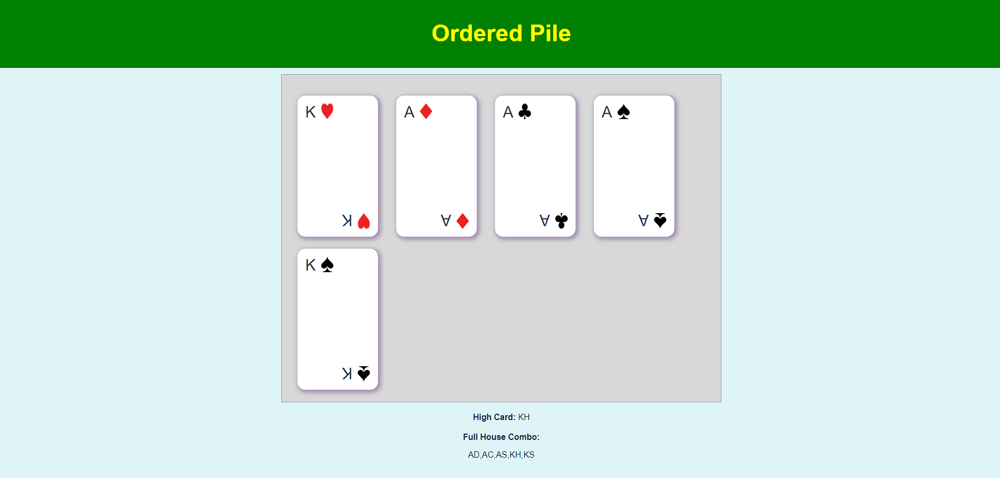

# Intricately Front-End challenge

> Front-End Vue.js challenge for Intricately.

This challenge relies on building a deck of cards and having its content ordered according to a given **rotation card**.

## Project setup

> [yarn](https://classic.yarnpkg.com/lang/en/) is required to run this project.
```
yarn install
```

### Running a development server
```
yarn serve
```

### Compiles and minifies for production
```
yarn build
```

### Running Tests
```
yarn test:unit
```

## Using the application

### Creating a new deck

A new deck can be created at route <code>/deck/new</code>. After accessing this route a form will be displayed, this form accepts up to 10 valid cars and a Rotation Card.


### Displaying a new deck

After creating a new deck it's possible to visualize the ordered cards at the route deck/:id. This page shows all the cards ordered according to the previous **rotation card**; the highest card on the pile; and all full house combinations.

> *After creating a new deck on **/deck/new** route you'll be redirected to **deck/:id***




